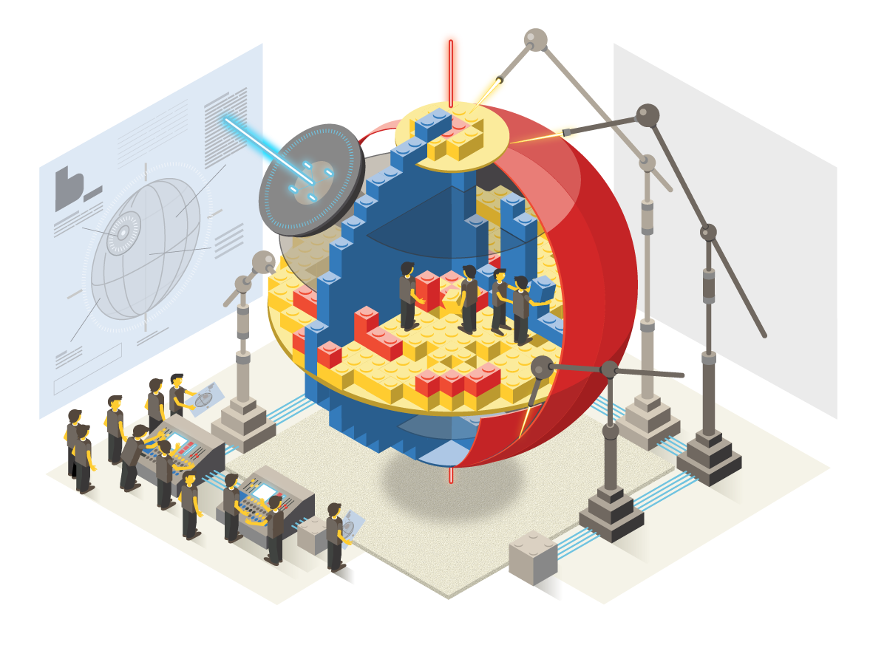
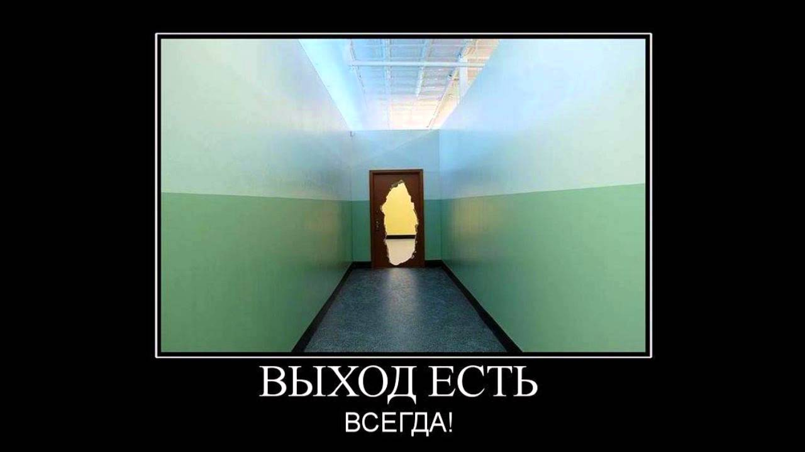
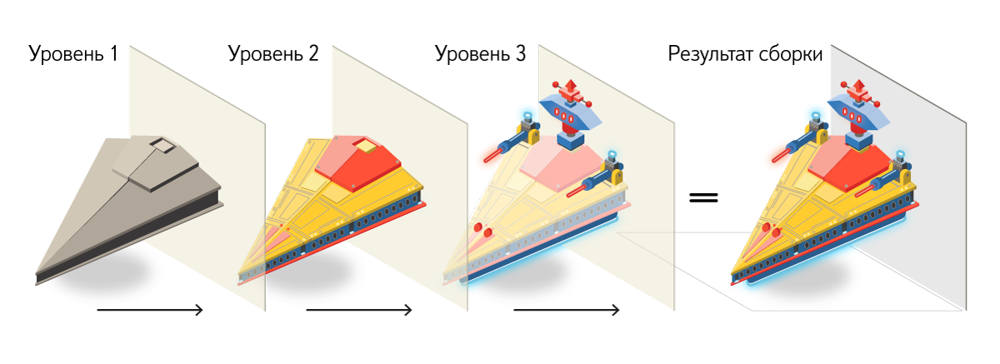

---

layout: default

---

# Яндекс

## **{{ site.presentation.title }}** {#cover}

    
{{ site.presentation.service }}





	
{{ site.author.name }},   {{ site.author.position }}

## О чём речь

* Сборка проекта при компонентном подходе
* ...Алгебра деклараций
* ...Композиция. Зависимости между компонентами
* ...Уровни переопределения

## **Этот подход применим без блоков, элементов, модификаторов**

## Компонентный подход

* [Bootstrap](https://github.com/twbs/bootstrap/tree/master/less)
* ...[БЭМ](https://github.com/bem/bem-components/tree/v2/common.blocks)
* ...[React](https://github.com/callemall/material-ui/tree/master/src)
* ...[Web Components](https://github.com/PolymerElements)

## ****
{:.cover}

## ****
{:.cover}

## Сборка при компонентном подходе

* Найти все компоненты на FS
* ...Написать require/import в каждой технологии

## Найти все компоненты на FS

* Собираем лишнее
* ...Не можем гарантировать порядок

## Написать require/import в каждой технологии

* Много ручной работы
* ...Вербозно
* ...Захардкоджены пути
* ...Медленно
* ...Мухи и котлеты

## ****
{:.cover}

## Декларируем бандл в терминах компонентов

* Не говорим, где физически находятся файлы
* ...Не говорим, какие технологии нам нужны

## Было

index.css

~~~ css
@import "../../path/to/component/component.css";
@import "../../path/to/component2/component2.css";
/* project styles */
~~~

index.js

~~~ js
require(../../path/to/component/component.js);
require(../../path/to/component2/component2.js);
/* project logic */
~~~

## Стало

index.decl.js

~~~ js
['component', 'components2']
~~~

* ...<s>Много ручной работы</s>
* ...<s>Вербозно</s>
* ...<s>Захардкоджены пути</s>
* ...<s>Медленно</s>
* ...<s>Мухи и котлеты</s>

## **Декларация — что и в каком порядке подключать в сборку**

## Получение декларации

* Интроспекция с файловой системы
* ...Написание руками
* ...Генерация по описанию страницы

## Генерация по описанию страницы

~~~ html

~~~

## **Алгебра деклараций**

## Алгебра деклараций

* Объединение
* Вычитание
* Пересечение

## Объединение

~~~ js
Декларация 1            Декларация 2            Декларация 3

[                       [                       [
    'header',               'header',               'header',
    'button',               'button',               'button',
    'link',                                         'link',
    'attach',     +                        =        'attach',
                            'menu',                 'menu',
                            'image',                'image',
    'checkbox',                                     'checkbox',
                            'popup'                 'popup',
    'textarea'                                      'textarea'
]                       ]                       ]
~~~

## Вычитание

~~~ js
Декларация 1            Декларация 2            Декларация 3

[                       [                       [
    'button',               'button',
    'checkbox',                                     'checkbox',
    'textarea',                                     'textarea',
    'suggest'                                       'suggest'
                            'header',
                    -       'input',       =
                            'button',
                            'menu'
]                       ]                       ]
~~~

## Пересечение

~~~ js
Декларация 1            Декларация 2            Декларация 3

[                       [                       [
    'header',               'header',               'header',
    'input',                'menu',
    'link',        ⋂        'button',     =
    'attach',               'input',
    'checkbox',             'image',
    'textarea',             'popup',
    'footer'                'footer'                'footer'
]                        ]                       ]
~~~

## Композиция. Зависимости между компонентами

* Зависимости как технология компонента

## Было

my-component.css

~~~ css
@import "../../path/to/component/component.css";
@import "../../path/to/component2/component2.css";
/* my-component styles */
~~~

my-component.js

~~~ js
require(../../path/to/component/component.js);
require(../../path/to/component2/component2.js);
/* my-component logic */
~~~

[Пример](https://github.com/callemall/material-ui/blob/master/src/AutoComplete/AutoComplete.js#L1-L11)

## Стало

my-component.deps.js

~~~ js
['component', 'components2']
~~~

## Стало

my-component.deps.js

~~~ js
{
    mustDeps: ['component'],
    shouldDeps: ['components2']
}
~~~

## **Уровни переопределения**

## ****
{:.cover}

## Уровни переопределения позволяют

* Дешево обновлять библиотечный код
* ...Разделять общие части реализации блоков от частных
* ...Разделять проект на платформы

## Пример

~~~
library-blocks/    # Уровень библиотеки
  input/
  button/          # Базовая реализация блока button
  popup/

project/           # Уровень проекта
  input/
  button/          # Измененная реализация блока button
  header/
~~~

## Пример

common.blocks/button/button.css

~~~ css
.button {
    height: 25px;
}
~~~

touch.block/button/button.css

~~~ css
.button {
    height: 50px;
    tap-highlight-color: #ccc;
}
~~~

## Было

~~~ css
@import "library/common.blocks/button/button.css";
@import "library/touch.block/button/button.css";
@import "library/design/common.block/button/button.css";
@import "library/design/touch.block/button/button.css";
@import "project/common.blocks/button/button.css";
@import "project/touch.blocks/button/button.css";
~~~

...И аналогично для JS.

## Стало
['button']

## Как это работает

* [Инструменты](https://github.com/bem-sdk)
* [Пример](https://github.com/bem/project-stub/tree/preparing-for-master)

## **Что дальше?**

## **[bem.info/methodology/ build](https://ru.bem.info/methodology/build/)**

## **Ваши вопросы!**

## **Контакты** {#contacts}

{{ site.author.name }}

 
<!-- 
{{ site.author.position }}
 -->

    

        
bem.info

        
info@bem.info

        
bem_ru&nbsp;&nbsp;&nbsp;&nbsp;#b_

        <!-- 
vk
 -->
        <!-- 
facebook
 -->
    

